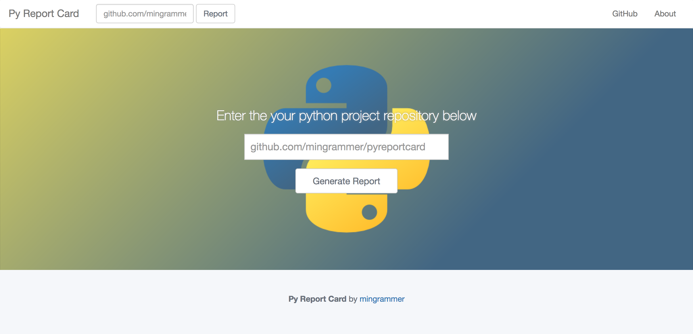

# Python Report Card
> *Inspired by [Go Report Card](https://github.com/gojp/goreportcard)*

A report card for your Python application. This inspects a python project is hosted on Github and analyze the source code quality (PEP8 and Pyflakes), existence of license file, test coverage, and some statistics of codebase. Then shows its analysis results to user.

*Note: In current, it is not completed yet. This project is in progress. We are ready to implement following features*

*Note: There is no analysis processing routines yet. So, it have an only main page, also can not see report page now yet. I'll add it ASAP*

## Install and Run

1. Clone this repository.
2. Run `pip install -r requirements.txt` to install all dependencies (If you don't have `pip`, install `pip` first)
3. Run server by `python3 run.py`.
4. Go `127.0.0.1:5000` and just use it.

## Screen Shot

## Features

* [x] Supports checking the code quality using PEP8 and Pyflakes linting tools
* [x] Supports counting the code lines and calculates some stats
* [x] Supports checking the license file
* [ ] Supports calculating the test coverage and shows test results
* [ ] Supports checking the compatibility of Python 2 and 3
* [ ] Supports checking the security issues
* [X] Provides a grade system
* [X] Provides a pyreportcard web server
* [ ] Serves it as web service
* [ ] Provides ranking system
* [ ] Provides badge link of repository grade

## Open Sources as dependencies
* [PEP8](http://pep8.readthedocs.io/en/release-1.7.x/)
* [Pyflakes](https://github.com/PyCQA/pyflakes)
* [Pymongo](https://github.com/mongodb/mongo-python-driver)
* [Flask](https://github.com/pallets/flask)

## License
The content of this project itself is licensed under the Creative Commons Attribution 3.0 license, and the underlying source code used to format and display that content is licensed under the MIT license.
