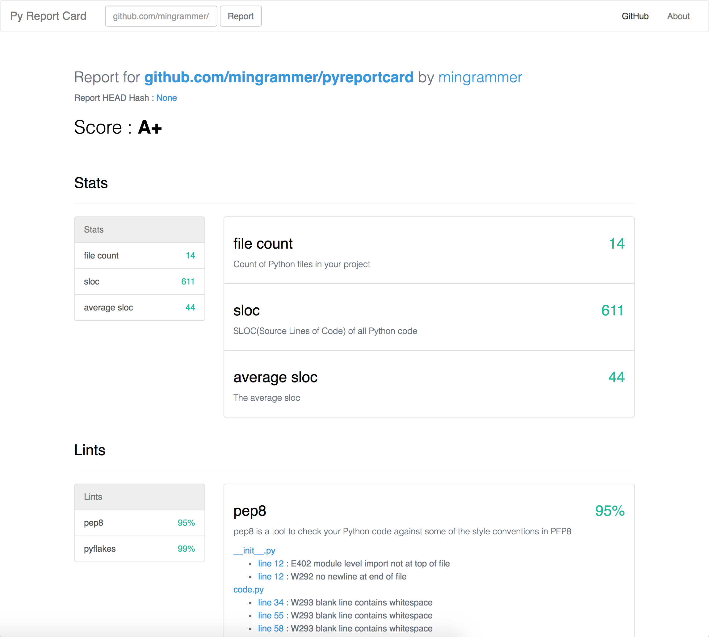

<br><br>

<h1 align="center">Python Report Card</h1>

<p align="center">
  <a href="/LICENSE"></a>
  <a href="https://docs.python.org/3/index.html"></a>
  <a href="https://www.python.org/dev/peps/pep-0008"></a>
  <a href="https://travis-ci.org/mingrammer/pyreportcard"></a>
</p>

<p align="center">
  Analyze and report the python projects which are on Github
</p>

<br><br><br>

> Inspired by [Go Report Card](https://github.com/gojp/goreportcard)

A report card for your Python applications. This analyzes the source code quality (pep8, pyflakes and bandit etc.) of the Python projects which are hosted on GitHub, checks for license and readme files, and provides some statistics. Then shows the results on the web.

You can see our planning for future versions in [here](https://github.com/mingrammer/pyreportcard/projects/1) too.

*Note: I'm preparing the supports of isolated running environments with Docker. I'll add it soon*

## ScreenShots




## Features

* [x] Supports checking the code quality using PEP8 and Pyflakes linting tools
* [x] Supports counting the code lines and calculates some stats
* [x] Supports checking the license file
* [x] Provides a grade system
* [x] Provides a pyreportcard web server
* [ ] Supports checking the compatibility of Python 2 and 3
* [ ] Supports checking the security issues
* [ ] Supports customizable analyzing using own configuration file
* [ ] Serves it as web service
* [ ] Provides ranking system
* [ ] Provides badge link of repository grade

## Install and Run

* Clone this repository.
* Run `pip install -r requirements.txt` to install all dependencies (If you don't have `pip`, install `pip` first)
* Install the [MongoDB](https://www.mongodb.com/) that is used for our backend database.
* You must configure the secret values in `config_secret.py`. Firstly, copy the example secret file to create secret file by `cp config_secret.py.example config_secret.py`, and then fill out the secret values with yours.

```python
class SecretConfig:
    SECRET_KEY = '...'

    MONGO_DBNAME = 'reportcard'
    MONGO_HOST = '...'
    MONGO_PORT = ...
    # MONGO_USER = '...'
    # MONGO_PASSWORD = '...'
```

* Run server by `python3 run.py`.
* Go `127.0.0.1:5000` and just use it.

*Note: Now, you can run it on local system only, But we'll provide isolated environments using Docker for installing and running soon.*

## Tests

*Note: We have a test code for only vcs module now. We'll add more tests for all features soon*

```bash
python3 -m unittest discover tests
```

## Dependencies
* [PEP8](http://pep8.readthedocs.io/en/release-1.7.x/)
* [Pyflakes](https://github.com/PyCQA/pyflakes)
* [Pymongo](https://github.com/mongodb/mongo-python-driver)
* [Flask](https://github.com/pallets/flask)
* [MongoDB](https://github.com/mongodb/mongo)

## License
The content of this project itself is licensed under the Creative Commons Attribution 3.0 license, and the underlying source code used to format and display that content is licensed under the MIT license.
